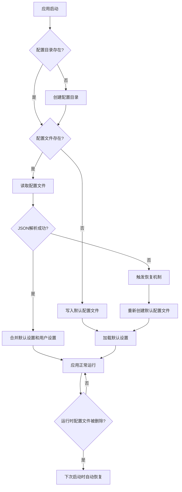

# 配置系统安全机制测试指南

本文档说明如何测试应用配置系统的安全机制，验证防止恶意破坏的保护措施。

## 安全机制概述

应用配置系统实现了以下安全机制：

1. **首次启动自动初始化**：应用首次启动时自动创建完整的默认配置文件
2. **配置文件损坏自动恢复**：当配置文件损坏或被删除时，自动恢复到默认配置
3. **内存默认值保护**：无论文件系统如何，应用始终可以使用内存中的默认配置运行
4. **无硬编码敏感信息**：所有敏感配置（如API密钥）通过环境变量管理

## 配置文件位置

### Windows
```
C:\Users\用户名\AppData\Roaming\note-studio\User\settings.json
```

### macOS
```
/Users/用户名/Library/Application Support/note-studio/User/settings.json
```

### Linux
```
~/.config/note-studio/User/settings.json
```

## 测试场景

### 测试 1: 首次启动自动初始化

**目的**：验证应用首次启动时能自动创建完整的默认配置文件

**步骤**：
1. 确保配置文件不存在（删除整个 `note-studio` 配置目录）
2. 启动应用
3. 检查控制台输出

**预期结果**：
```
[SettingsManager] 开始初始化设置管理器...
[SettingsManager] 设置目录已创建: C:\Users\...\note-studio\User
[SettingsManager] 配置文件不存在，创建默认配置...
[SettingsManager]  已成功写入默认配置文件
[SettingsManager] 配置文件路径: C:\Users\...\note-studio\User\settings.json
[SettingsManager] 设置管理器初始化成功 
```

**验证**：
- 配置目录被创建
- `settings.json` 文件存在且包含完整的默认配置
- 应用正常启动和运行

---

### 测试 2: 配置文件删除后自动恢复

**目的**：验证配置文件被删除后，应用能自动恢复

**步骤**：
1. 启动应用并确认运行正常
2. 在应用运行时或关闭后，手动删除 `settings.json` 文件
3. 重新启动应用
4. 检查控制台输出

**预期结果**：
```
[SettingsManager] 配置文件不存在，将使用默认设置
[SettingsManager]  加载设置失败，回退到默认设置
[SettingsManager] 🔧 尝试恢复配置文件...
[SettingsManager]  配置文件已成功恢复到默认状态
```

**验证**：
- 应用正常启动，没有崩溃
- 配置文件被自动重新创建
- 应用使用默认设置运行
- 用户可以正常使用所有功能

---

### 测试 3: 配置文件损坏后自动恢复

**目的**：验证配置文件损坏（无效JSON）时，应用能自动恢复

**步骤**：
1. 关闭应用
2. 打开 `settings.json` 文件
3. 破坏文件内容（例如：删除部分字符，使其成为无效的 JSON）
   ```json
   {
     "editor.fontSize": 14,
     "editor.fontFamily": "Consolas   // 删除了闭合引号和括号
   ```
4. 保存文件
5. 启动应用
6. 检查控制台输出

**预期结果**：
```
[SettingsManager]  配置文件 JSON 解析失败，文件可能已损坏
[SettingsManager] 触发自动恢复机制...
[SettingsManager] 🔧 尝试恢复配置文件...
[SettingsManager]  配置文件已成功恢复到默认状态
```

**验证**：
- 应用正常启动，没有崩溃
- 损坏的配置文件被替换为有效的默认配置
- 应用使用默认设置运行
- 用户之前的配置会丢失（这是预期行为，安全优先）

---

### 测试 4: 配置目录权限问题

**目的**：验证无法写入配置文件时，应用仍能运行

**步骤**：
1. 启动应用
2. 将配置目录设置为只读权限
3. 尝试修改设置（通过应用界面）
4. 检查应用行为

**预期结果**：
- 应用继续使用内存中的配置运行
- 控制台显示警告信息但不会崩溃
- 用户可以修改设置（内存中），但重启后会丢失

**注意**：这是一种降级处理，保证应用可用性

---

### 测试 5: 环境变量配置（内置AI）

**目的**：验证敏感信息通过环境变量管理

**步骤**：
1. 检查代码中是否还有硬编码的 API 密钥
2. 创建 `.env` 文件：
   ```
   BUILTIN_AI_API_KEY=test-key-12345
   BUILTIN_AI_BASE_URL=https://api.example.com/v1
   ```
3. 启动应用
4. 检查控制台输出

**预期结果**：
```
[BuiltinAI]  已从环境变量加载内置AI配置
[BuiltinAI] Base URL: https://api.example.com/v1
```

**如果未配置环境变量**：
```
[BuiltinAI]  未配置内置AI的API密钥
[BuiltinAI] 请在 .env 文件中设置 BUILTIN_AI_API_KEY
[BuiltinAI] 内置AI功能将不可用，但不影响应用正常运行
```

**验证**：
- 没有硬编码的 API 密钥在代码中
- `.env` 文件在 `.gitignore` 中（不会被提交）
- 应用能正确读取环境变量
- 未配置时应用仍能正常运行（只是内置AI功能不可用）

---

## 安全机制工作流程



## 预期控制台输出示例

### 正常启动（配置文件存在且有效）
```
[SettingsManager] 开始初始化设置管理器...
[SettingsManager] 设置目录已创建: C:\Users\...\note-studio\User
[SettingsManager] 配置文件已存在
[SettingsManager] ========== 开始加载设置 ==========
[SettingsManager] 设置加载成功 
[SettingsManager] 设置管理器初始化成功 
```

### 首次启动
```
[SettingsManager] 开始初始化设置管理器...
[SettingsManager] 设置目录已创建: C:\Users\...\note-studio\User
[SettingsManager] 配置文件不存在，创建默认配置...
[SettingsManager]  已成功写入默认配置文件
[SettingsManager] 设置管理器初始化成功 
```

### 配置文件损坏
```
[SettingsManager]  配置文件 JSON 解析失败，文件可能已损坏
[SettingsManager] 触发自动恢复机制...
[SettingsManager] 🔧 尝试恢复配置文件...
[SettingsManager]  配置文件已成功恢复到默认状态
[SettingsManager] 应用将继续使用内存中的默认设置运行
```

## 测试检查清单

- [ ] 首次启动能自动创建配置文件
- [ ] 配置文件删除后能自动恢复
- [ ] 配置文件损坏（无效JSON）后能自动恢复
- [ ] 无法写入文件时应用仍能运行（使用内存配置）
- [ ] 代码中没有硬编码的敏感信息（API密钥）
- [ ] 环境变量配置正常工作
- [ ] `.env` 文件在 `.gitignore` 中
- [ ] 所有安全机制不会阻止应用启动
- [ ] 错误日志清晰且有帮助

## 常见问题

### Q: 用户配置会丢失吗？
A: 只有在以下情况下用户配置会丢失：
- 配置文件被手动删除
- 配置文件损坏到无法解析
- 这些都是不可恢复的情况，安全机制会重置为默认配置以保证应用可用

### Q: 如何备份用户配置？
A: 用户可以：
1. 手动复制 `settings.json` 文件
2. 使用应用内的导出功能（如果实现）

### Q: 为什么不尝试修复损坏的配置文件？
A: 出于安全考虑，我们选择完全重置而不是尝试修复：
- 部分损坏的配置可能导致不可预测的行为
- 完全重置是最安全和可靠的方案
- 用户可以重新配置（虽然不便，但保证安全）

## 安全最佳实践

1. **定期备份重要配置**
2. **不要手动编辑配置文件**（除非你知道你在做什么）
3. **妥善保管 `.env` 文件**，不要提交到版本控制
4. **定期更新 API 密钥**
5. **监控应用日志**，及时发现配置问题

## 总结

配置系统的安全机制确保了：
- **可用性**：无论配置文件状态如何，应用始终能启动和运行
- **安全性**：敏感信息不会硬编码，通过环境变量管理
- **可恢复性**：配置文件损坏或丢失时能自动恢复
- **透明性**：所有操作都有清晰的日志输出

这些机制共同构成了一个健壮的配置系统，能够抵御常见的配置文件破坏场景。


